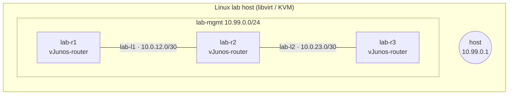

# Juniper 7-Day Sprint

[](https://github.com/rohanbatrain/juniper-7-day-sprint/actions/workflows/validate.yml)

A seven-day, hands-on **Juniper Junos lab sprint** — routing, switching, security and
data-centre concepts — built as topology-as-code on plain libvirt/KVM, broken on purpose,
fixed under pressure, and documented in public.

Everything here runs on a single Linux host. No Docker daemon, no hypervisor product, no
licences: just `qemu`, `libvirt`, and Juniper's free lab images.

## The lab



- Each node is a libvirt domain: 4 vCPU, 5 GiB, virtio NICs, a 32 MiB FAT **config disk**
  carrying `config/juniper.conf`, and a serial console (`virsh console`).
- Management is a host-only bridge. Every link is its own bridge — a virtual patch panel.
- The lab has **no uplink and no NAT**: an `nft` table drops guest→host new connections and
  all lab forwarding, so the lab cannot reach the LAN or the internet.
- Base images are read-only; each node boots from a qcow2 overlay, so `snapshot` /
  `restore` gives you instant rollback for every "break it" drill.

## Quickstart

On the lab host:

```bash
git clone git@github.com:rohanbatrain/juniper-7-day-sprint.git
cd juniper-7-day-sprint
sudo LAB_OWNER=$USER bash ops/lab-host-setup.sh   # one-time: storage dirs, tool check

# drop the free images from Juniper's lab download area into /home/lab/images
#   vJunos-router-*.qcow2     (routing days)
#   vJunos-switch-*.qcow2     (switching / EVPN days)

make up            # generate + define + start day-01 topology
make status
make console NODE=r1
```

Nodes take 5–15 minutes to boot (they are nested VMs inside the VM image). Watch the console
or `virsh domstate`. When `login:` appears, log in as `admin` / `admin@123`.

## The seven days

| Day | Focus | Topology |
| --- | --- | --- |
| 1 | Junos fundamentals + CLI | [day-01](day-01/) · `lab-r1`, `lab-r2` |
| 2 | Routing + switching (VLANs, OSPF) | [day-02](day-02/) · adds `lab-sw1`, `lab-sw2` |
| 3 | Cloud networking concepts | [day-03](day-03/) · maps onto day-01/02 |
| 4 | Security: zones, filters, segmentation | [day-04](day-04/) · reuses day-02 |
| 5 | Mist AI: architecture + assurance | [day-05](day-05/) · design doc |
| 6 | Data centre: spine/leaf, EVPN-VXLAN | [day-06](day-06/) · 2 spines, 2 leaves |
| 7 | Automation: APIs, Ansible, config gen | [day-07](day-07/) · control node |

Each day follows the same loop: **learn → reproduce → change → break → troubleshoot →
document → automate**. The daily READMEs carry the objectives, the commands, and the drills.

## Repository layout

```
ops/           lab lifecycle tooling (generate, up/down, console, snapshot, destroy)
lab/           topologies (TOML), node config templates, per-day startup configs
docs/          architecture, addressing plan, the seven-day plan, decision notes
day-01..07/    daily notes, configs and drills
```

See [docs/architecture.md](docs/architecture.md) for the design,
[docs/addressing.md](docs/addressing.md) for the addressing plan, and
[docs/decisions/](docs/decisions/) for *why* it is built this way.

## Ground rules

- The lab is **isolated by construction**: host-only bridges, no NAT, an `nft` table that
  denies lab→host and lab→anything forwarding.
- Nothing autostarts. `make up` starts nodes, `make down` pauses them gracefully
  (configs persist in the overlay disks). `make destroy` removes the node disks.
- Images come from Juniper's free lab download area and need no account or licence.
  vJunos images are **nested** and cannot run inside a VM — the lab host must be bare metal
  (or a first-level hypervisor guest) with nested KVM enabled.

## Disclosure

This is a personal learning sprint. Posts and screenshots from it contain lab addressing
only — no hostnames, IPs, tokens, customer data, or anything from a private network.
See [docs/disclosure.md](docs/disclosure.md).

## Licence

No licence is granted yet — the repository is public for reading and learning. Ask before
reusing.
