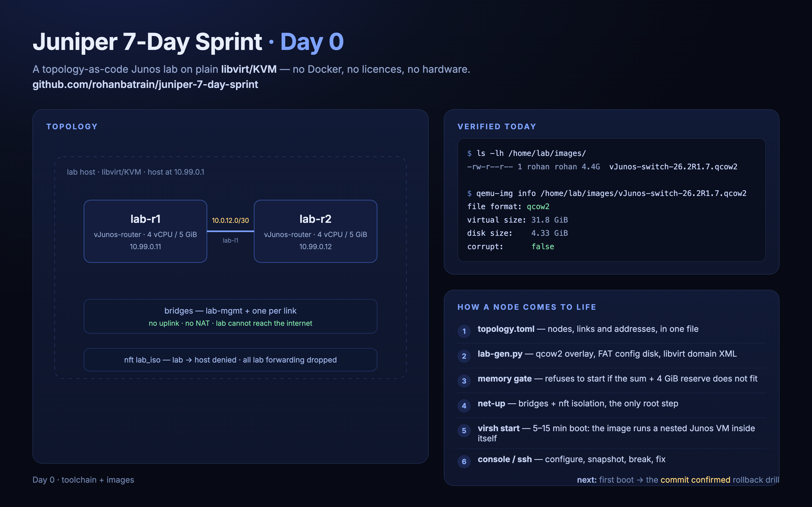

# Day 0 — building the lab

*A seven-day, hands-on Juniper Junos lab — built as topology-as-code on plain libvirt/KVM,
broken on purpose, fixed in public.*

- Repository: [rohanbatrain/juniper-7-day-sprint](https://github.com/rohanbatrain/juniper-7-day-sprint)
- Next: [Day 1 — Junos fundamentals](../../day-01/)

## Why build a lab instead of renting one

Cloud sandboxes hand you a finished lab. That teaches the exercises, not the lab. The whole
point of this week is the layer underneath: namespaces, bridges, bootstraps, isolation — the
things that decide whether a network behaves. So the lab is mine, and it lives as code.

## Three facts that shaped the build

1. **The vendor images are nested.** vJunos-router and vJunos-switch run a control-plane VM
   *inside* the VM. Juniper documents that they cannot be launched from inside another VM —
   the lab had to sit directly on a Linux host, and that host needs nested KVM enabled.
2. **That ruled out the obvious tool.** containerlab (and every “routers-in-containers”
   workflow) needs a Docker daemon and runs privileged containers. The host already runs
   QEMU through libvirt for other work — so the lab became plain libvirt domains: no daemon,
   no licences, no new services.
3. **These images bootstrap from a USB FAT disk.** Not cloud-init, not an ISO. A 32 MiB FAT
   volume labelled `vmm-data` holding one tarball with `config/juniper.conf`. Reproducing
   that is ~30 lines of Python — and owning it is why the lab starts with real IPs on the
   management interfaces instead of an afternoon of console typing.

## What “topology as code” means here

One file per lab (`lab/topologies/day-01-routing.toml`) declares nodes, links and addresses.
`make up` then generates per-node artifacts, checks memory, brings up the network, and
defines and starts the domains. The generator — not a human — writes:

- the **qcow2 overlay**: the vendor image stays read-only; every node writes to its own
  copy-on-write layer, so snapshots are free and the base is pristine forever;
- the **config disk**: `config/juniper.conf` (hostname, admin, SSH, NETCONF, management
  address, default route in `mgmt_junos`) is tarred into `vmm-config.tgz`, written into the
  FAT volume with `mkfs.vfat` + `mcopy`, and attached to the VM as a **USB mass-storage
  device** — the exact mechanism the vendor image expects;
- the **domain XML**: 4 vCPU, 5 GiB, `host-passthrough` CPU (the nested control-plane VM
  needs `vmx` visible), virtio NICs, a serial console, and low CPU shares so the rest of the
  machine wins contention;
- the **network scripts**: a management bridge plus one bridge per point-to-point link — a
  virtual patch panel, where each link is its own broadcast domain — and an `nft` table that
  drops lab→host connections and all lab forwarding. No NAT is a feature: the lab genuinely
  has nowhere to go.

## The lifecycle

| Command | What it does |
| --- | --- |
| `make up` | memory gate → generate → net-up → define + start |
| `make snapshot NODE=r1 NAME=pre-ospf` | snapshot before you break something |
| `make console NODE=r1` / `make ssh NODE=r1` | serial console / SSH to the management address |
| `make down` | graceful shutdown; disks and configs persist |
| `make destroy` | remove domains, disks and the lab network |

## What was verified on day 0

- The switch image (`vJunos-switch-26.2R1.7`, 4.33 GiB on disk) downloaded to the lab host
  and passed `qemu-img info` (`corrupt: false`).
- The lab storage is group-shared with the QEMU runtime user (mode 2770), so the hypervisor
  opens node disks without touching its global configuration.
- The switch’s launch recipe was read and encoded: SeaBIOS (not UEFI), SMBIOS `VM-VEX`, and
  the same USB config-disk mechanism as the router.

## Next

First boot of `lab-r1`/`lab-r2`, then Day 1: interfaces, the `commit confirmed` rollback
drill, and the first ping across the lab.
