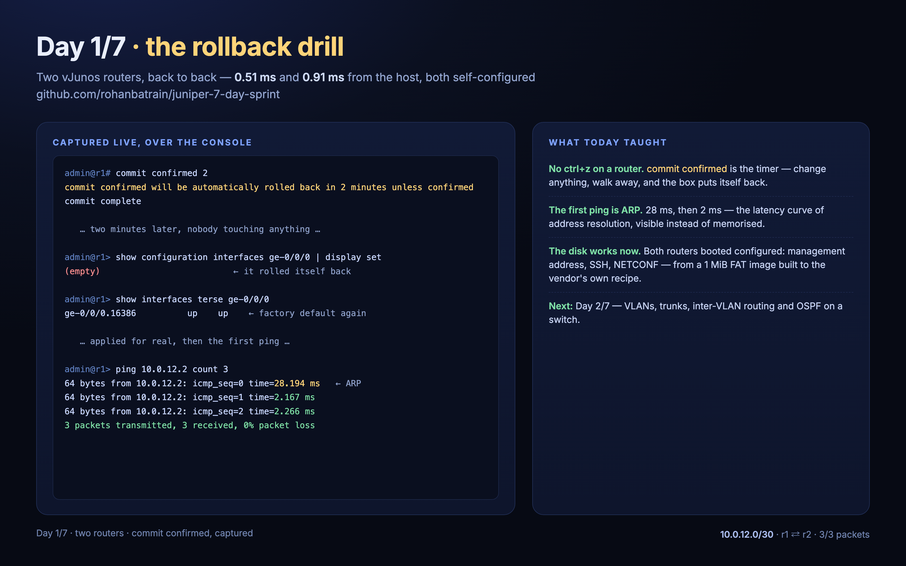

# Day 1 — two routers, and the rollback that saved me



*A seven-day, hands-on Juniper Junos lab — built as topology-as-code on plain libvirt/KVM.*

- Repository: [rohanbatrain/juniper-7-day-sprint](https://github.com/rohanbatrain/juniper-7-day-sprint)
- Previous: [Day 0](day-0.md)

## What came up

Two vJunos routers (`lab-r1`, `lab-r2`), back to back on a /30 — and they came up
**self-configured**: the vendor-exact config disk (1 MiB — the fix from yesterday) handed
them their management addresses, admin user, SSH and NETCONF with no console step. Both
answered in under a millisecond:

| Node | Management | Ping | SSH banner |
| --- | --- | --- | --- |
| lab-r1 | 10.99.0.11 | 0.51 ms | `SSH-2.0-JSSH_4.1` |
| lab-r2 | 10.99.0.12 | 0.91 ms | `SSH-2.0-JSSH_4.1` |

## The drill that mattered: `commit confirmed`

There is no ctrl+z on a router. There is a timer:

```text
admin@r1> configure
admin@r1# set interfaces ge-0/0/0 unit 0 family inet address 10.0.12.1/30
admin@r1# set interfaces lo0 unit 0 family inet address 10.255.0.1/32
admin@r1# commit confirmed 2
commit confirmed will be automatically rolled back in 2 minutes unless confirmed
commit complete

# commit confirmed will be rolled back in 2 minutes
```

Two minutes later, with nobody touching anything:

```text
admin@r1> show configuration interfaces ge-0/0/0 | display set
(empty)

admin@r1> show interfaces terse ge-0/0/0
Interface               Admin Link Proto    Local                 Remote
ge-0/0/0                up    up
ge-0/0/0.16386          up    up
```

The configuration had rolled itself back — the interface was back to its factory default.
Applied again, this time for real, and confirmed with a plain `commit`:

```text
admin@r1> show interfaces terse ge-0/0/0
ge-0/0/0.0              up    up   inet     10.0.12.1/30
```

That two-minute window is the seatbelt for every change this week.

## The first ping

```text
admin@r1> ping 10.0.12.2 count 3
64 bytes from 10.0.12.2: icmp_seq=0 ttl=64 time=28.194 ms
64 bytes from 10.0.12.2: icmp_seq=1 ttl=64 time=2.167 ms
64 bytes from 10.0.12.2: icmp_seq=2 ttl=64 time=2.266 ms
3 packets transmitted, 3 packets received, 0% packet loss
```

The first packet took 28 ms; the next two took 2. That 26-millisecond difference is ARP
resolving the far side the first time — a latency curve you can *see* instead of memorise.

Both directions verified (r2→r1: 3/3, 1.4–1.7 ms), and the routing table confirms it:

```text
10.0.12.0/30       *[Direct/0] 00:01:18
                    >  via ge-0/0/0.0
```

## Also learned today

- The serial console is a slow UART: unpaced writes over ~60 characters drop characters
  (spaces vanish first). Automation writes in ~20-byte chunks with a 90 ms pause.
- The console speaks two dialects: `admin` lands in the CLI, `root` in the shell — the driver
  reads the prompt and speaks the right one.
- Console ports are per-node-order, so one topology runs at a time.

## Next

Day 2: VLANs, trunks, inter-VLAN routing and OSPF — with a real switch. The lab grows.
