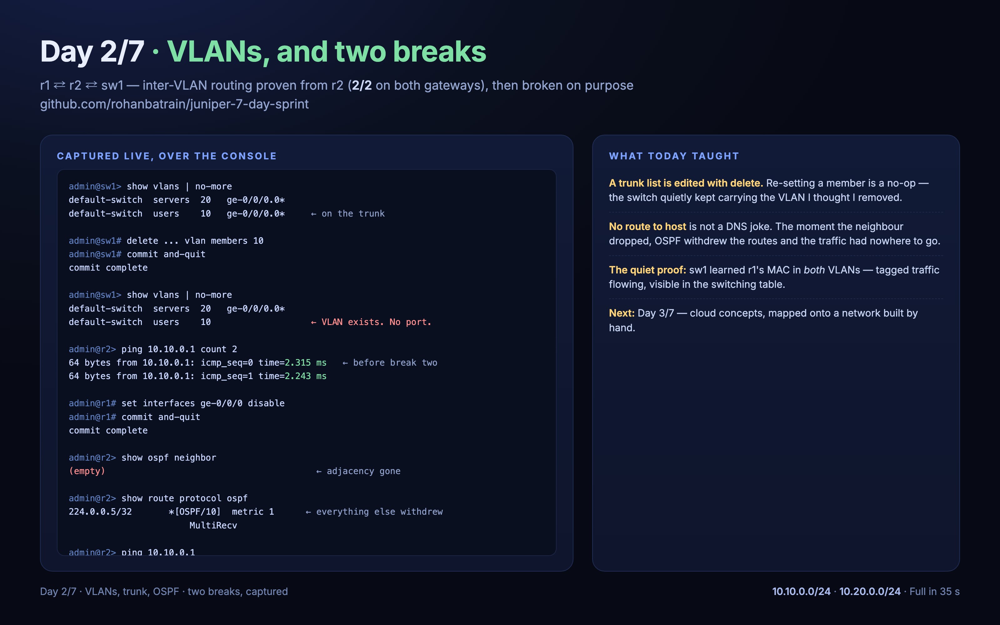

# Day 2 — VLANs, trunks, and the break that taught the most



*A seven-day, hands-on Juniper Junos lab — built as topology-as-code on plain libvirt/KVM.*

- Repository: [rohanbatrain/juniper-7-day-sprint](https://github.com/rohanbatrain/juniper-7-day-sprint)
- Previous: [Day 1](day-1.md)

## The lab grows: a switch joins

Three nodes, and the first topology where **every** node self-configured from its bootstrap
disk: two routers and a virtual EX9214 switch, wired `r1 ⇄ r2` and `r1 ⇄ sw1`.

## What got built

- On the switch: **VLAN 10 (users)** and **VLAN 20 (servers)**, carried on a trunk to r1:

  ```text
  default-switch  servers  20   ge-0/0/0.0*
  default-switch  users    10   ge-0/0/0.0*
  ```

- On r1: **router-on-a-stick** — `vlan-tagging` on the uplink, a tagged subinterface per
  VLAN, and their addresses as the gateways (`10.10.0.1/24`, `10.20.0.1/24`).
- OSPF on r1 and r2, with r1 advertising both VLAN subnets into the backbone.

The proof, from r2 — which has no VLANs of its own:

```text
admin@r2> ping 10.10.0.1 count 2     ← the users gateway
2 packets transmitted, 2 received, 0% packet loss

admin@r2> ping 10.20.0.1 count 2     ← the servers gateway
2 packets transmitted, 2 received, 0% packet loss
```

And on the switch, r1's MAC learned in **both** VLANs — tagged traffic actually flowing:

```text
Ethernet switching table : 2 entries, 2 learned
    servers             02:00:00:00:01:02   D   ge-0/0/0.0
    users               02:00:00:00:01:02   D   ge-0/0/0.0
```

## Break one: the removal that wasn't

I "removed" VLAN 10 from the trunk by re-setting the member list. Nothing changed —
because `set … vlan members 20` sets a member; it does not clear the others. The actual
removal is a `delete`, and the switch then told the story by itself:

```text
default-switch  servers  20   ge-0/0/0.0*
default-switch  users    10                 ← VLAN exists; no port carries it
```

Restoring the member put the trunk back. A trunk's VLAN list is edited with `delete`, not
with a re-set.

## Break two: withdraw everything

Shutting r1's uplink to r2 removed the adjacency, the routes, and the traffic — in that
order:

```text
admin@r2> show ospf neighbor
(empty)

admin@r2> show route protocol ospf
224.0.0.5/32       *[OSPF/10]  metric 1    ← the only route left; the rest withdrew
                       MultiRecv

admin@r2> ping 10.10.0.1
ping: sendto: No route to host
```

Restore the link and it all comes back — adjacency `Full` in ~35 seconds, pings clean.
`No route to host` is not a DNS joke here: it is the routing table, minus the routes OSPF
withdrew the moment the neighbour went away.

## Also learned today

- The console is a slow UART: never send `cmd; cmd; cmd` chains (spaces vanish). One command
  per line, paced — the automation was taught this the hard way, twice.
- With no host endpoints behind the switch, the VLAN membership is proven through the
  switch's own state (`show vlans`, the MAC table) and routed reachability is proven from the
  far router. Both are real tests; neither needed a fake host.

## Next

Day 3: cloud concepts, mapped onto a network we built by hand.
